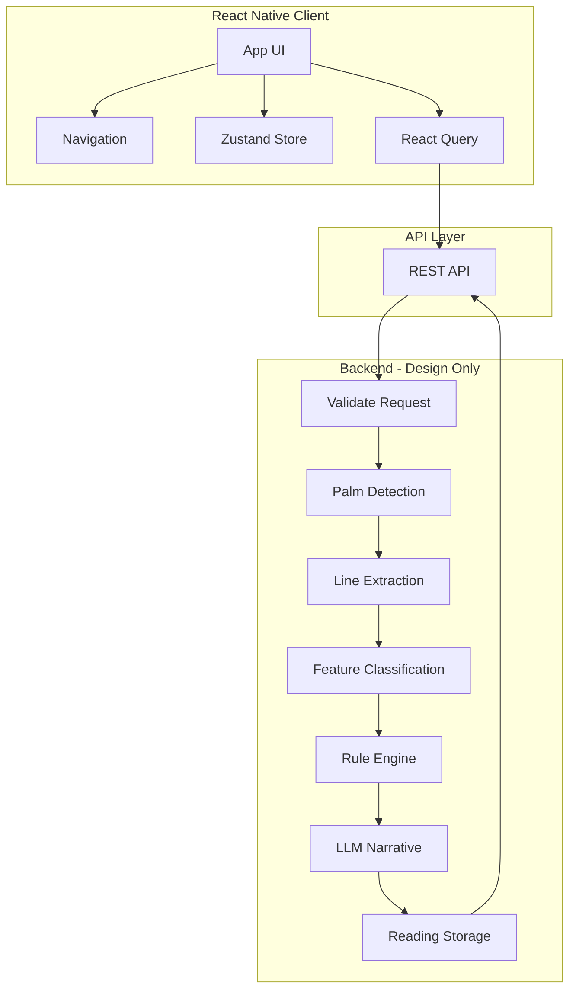
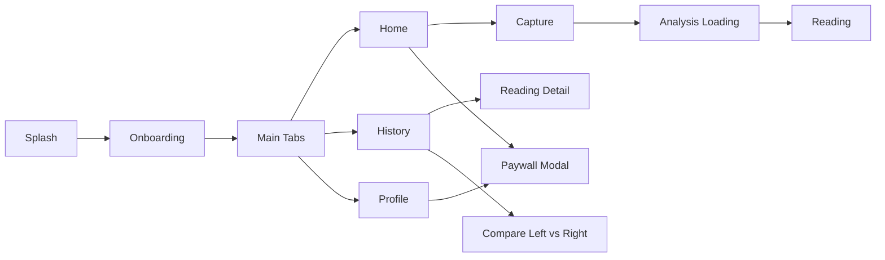

# System Architecture: AI Palm Reading Mobile App

## 1. High-Level System Diagram

---

## 2. Data Flow

1. **Capture:** User captures palm → client compresses image → uploads to `POST /analyze` (with hand side, dominant flag).
2. **Server (design):** Validate → store image reference → palm detection → line extraction → feature vector → rule engine → traits → LLM narrative → persist reading → return reading ID (or job ID for async).
3. **Client:** On success, navigate to loading then fetch `GET /readings/:id` (or poll by job ID). Render reading in card-based UI; allow share and save to history.

---

## 3. Key Screens & Navigation

**Route list (conceptual):**

| Route / Screen | Purpose |
|----------------|--------|
| `Splash` | Initial load; then redirect to Onboarding or Main. |
| `Onboarding` | Welcome → Disclaimer → Hand choice → Camera permission. |
| `Main` (tabs) | Home \| History \| Profile. |
| `Home` | CTA for new reading. |
| `Capture` | Camera + overlay + guidance; preview + retake. |
| `AnalysisLoading` | Ritualistic loading; poll or wait for reading. |
| `Reading` | Card-based sections; share. |
| `ReadingDetail` | Single reading from history. |
| `Compare` | Left vs right (when both exist). |
| `Profile` | Settings, premium CTA. |
| `Paywall` | Modal when premium feature tapped. |

---

## 4. Component Overview

- **App shell:** Root provider (QueryClient, GestureHandler, SafeArea), navigation container.
- **Screens:** Onboarding, Capture, AnalysisLoading, Reading, ReadingDetail, Compare, Profile, Paywall; each in `app/screens/`.
- **Shared components:** Buttons, cards, capture overlay, analysis loader, reading cards, share sheet (in `app/components/`).
- **Store:** User, onboarding completion, readings list, capture/analysis state, premium status (`app/store/`).
- **Services:** API client, camera wrapper, storage (`app/services/`).
- **Hooks:** useCamera, useAnalysis, useAuth, usePaywall, etc. (`app/hooks/`).

---

## 5. Security Model

- **Auth:** Optional anonymous ID or account; JWT/session for API when implemented.
- **API keys:** From environment; never in client bundle.
- **Palm data:** Not sent to analytics; not logged in production.
